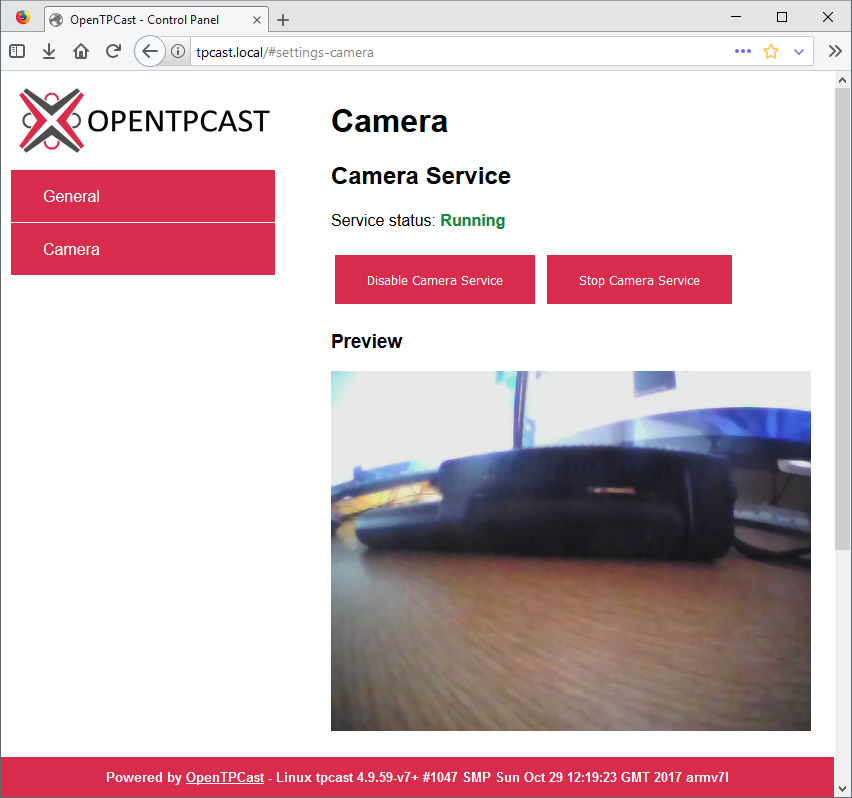

# Using The OpenTPCast Camera Service

## Table Of Contents
* [Overview](#overview)
* [Launching The Camera Service Automatically](#launching-the-camera-service-automatically)
* [Using The Camera Service Web API](#using-the-camera-service-web-api)

## Overview

A Camera Service is available which enables the on-board camera of the HTC Vive, or a compatible USB camera to be streamed over HTTP, which can be displayed in third party VR overlay software (e.g. [OVRDrop](http://store.steampowered.com/app/586210/OVRdrop/)).

## Launching The Camera Service Automatically
To launch the Camera Service automatically when the TPCast power box is powered on:
1. Navigate to http://tpcast.local (or `http://<tpcast-ip-address>` if not using Bonjour) in your web browser.
1. Navigate to `Camera` > `Camera Service`, and click `Enable Camera Service`.
1. Navigate to http://tpcast.local:8080/?action=stream in your web browser to access the camera feed.  This URL can be then be displayed in VR using third party VR overlay software.

To prevent the Camera Service from launching automatically when the TPCast is powered on, click `Disable Camera Service`.

## Using The Camera Service Web API
A JSON web API is provided to be utilized by overlay software to manage and query the state of the Camera Service.  Please note that the Camera Service does not have to be enabled in the OpenTPCast Control Panel to use the web API.

http://tpcast.local/api/camera/start will start the Camera Service if it not running and the camera device is available.

http://tpcast.local/api/camera/stop will stop the Camera Service if it is running.

http://tpcast.local/api/camera/status will return the current running status of the Camera Service.
