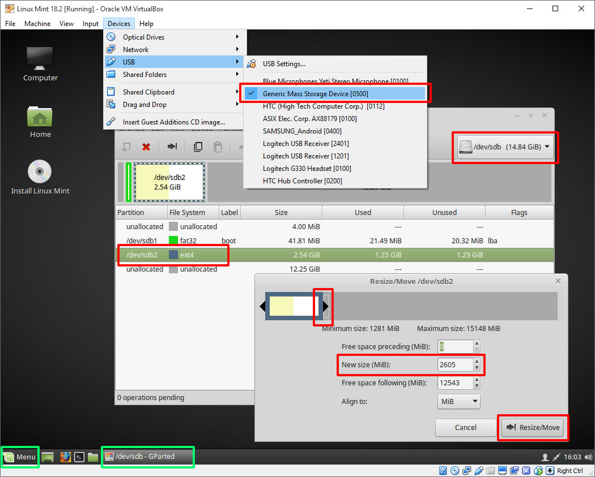

# Preparing A OpenTPCast Image (Maintainer's Guide)

**This guide is not intended for end users, who should download and flash officially released OpenTPCast images from https://github.com/OpenTPCast/Docs/releases**

## Overview
This guide provides instructions for OpenTPCast image maintainers on how to upgrade a Raspbian Stretch Lite image to an OpenTPCast image, and how to prepare the image for distribution to end users.

## Preparation
### Hardware
- A USB ethernet adapter is required to connect the TPCast power box to an internet connected router to perform the image preparation process.
- Disconnect the battery from the TPCast power box before removing or inserting the MicroSD card.
- Disconnect the USB and power cables from the TPCast power box, and connect a USB ethernet adapter into the USB port of the TPCast power box, with an ethernet cable connected to an internet connected router.

### Software
- Download and install [Win32 Disk Imager](https://sourceforge.net/projects/win32diskimager/) on your local machine, which will be used to back up and restore images to and from a MicroSD card.
- Download and install [Putty SSH client](http://www.putty.org/) on your local machine, which will be used to connect to your TPCast power box.
- Download and install [7-Zip](http://www.7-zip.org/) on your local machine, which will be used to compress the OpenTPCast image.
- Download and install [VirtualBox](https://www.virtualbox.org/wiki/Downloads), and download the latest image of [Linux Mint](https://linuxmint.com/download.php), which will be used to shrink the OpenTPCast image.
    - Launch Virtualbox, create a new Ubuntu virtual machine with default settings, and load the Linux Mint image as an optical disk, then power up the virtual machine to boot the Linux Mint live environment.
- Download the latest [Raspbian Stretch Lite](https://downloads.raspberrypi.org/raspbian_lite_latest) image, which will be the base image that OpenTPCast is built on top of.

## Flashing a stock Raspbian Stretch image to MicroSD card
1. Connect the MicroSD card to your computer using a MicroSD card reader.
1. Launch Win32 Disk Imager.
1. In the `Image File` field, select the Raspbian Stretch Lite image file.
1. Select the MicroSD drive from the `Device` drop down list.
1. Click `Write` to flash the image to your MicroSD card.
1. In Windows Explorer, navigate to the MicroSD card's boot partition, and create an empty file called `ssh`.

## Upgrading the Raspbian Stretch image to OpenTPCast
1. Insert the Raspbian Stretch flashed MicroSD card into the TPCast power box.
1. Power up the TPCast power box by plugging in the battery and wait a few minutes, then launch Putty and connect with the following details:
	- Hostname: Locate the IP address of the TPCast power box by checking your router's connected client list (e.g. 192.168.XXX.XXX).
	- Port: 22
	- Username: pi
	- Password: raspberry
1. In the Putty terminal, run the following command to begin the upgrade process:
```bash
sudo wget -e check_certificate=off https://rawgit.com/OpenTPCast/Docs/master/files/prepareimage/opentpcast-prepareimage && sudo chmod +x ./opentpcast-prepareimage && sudo ./opentpcast-prepareimage
```
1. Once the upgrade has completed, wait a few seconds to allow the TPCast power box enough time to shut down (the green indicator light on the TPCast power box will stop flashing once complete), then unplug the battery from the TPCast power box to power it off.
1. Remove the upgraded MicroSD card from the TPCast power box.

## Shrinking the OpenTPCast image

1. Connect the OpenTPCast flashed MicroSD card to your computer using a MicroSD card reader.
1. Launch VirtualBox and load the Linux Mint virtual machine.
1. On the virtual machine window, navigate to `Devices` > `USB` and select the MicroSD card reader.
1. Inside the Linux Mint virtual machine, launch GParted from the Menu.
1. In GParted, select the MicroSD card (e.g. /dev/sdb) from the device drop down list.
1. Right click the ext4 partition and select `Unmount`.
1. Right click the ext4 partition and select `Resize/Move`.
1. Drag the slider bar or adjust the `New Size (MiB)` field to an appropriate size (e.g. 2600), then click `Resize/Move` to apply the change.
1. Select `Edit` > `Apply All Operations` to finalize the changes.
1. Close GParted, and on the virtual machine window, navigate to `Devices` > `USB` and deselect the MicroSD card reader to eject it from the virtual machine.

## Saving the OpenTPCast image to an image file for distribution
1. Connect the OpenTPCast flashed MicroSD card to your computer using a MicroSD card reader.
1. Launch Win32 Disk Imager.
1. In the `Image File` field, select a file path and enter a file name that will become your backup image. (e.g. C:/opentpcast.img).
1. Select the MicroSD drive from the `Device` drop down list.
1. Click `Read` to back up the image to your computer.

## Compressing the OpenTPCast image for distribution
1. Right click the OpenTPCast image file and navigate to `7-Zip` > `Add to archive...`
1. Use the following settings to compress the image:
	- Archive format: 7z
	- Compression level: Ultra
1. Click `OK` to compress the image.
