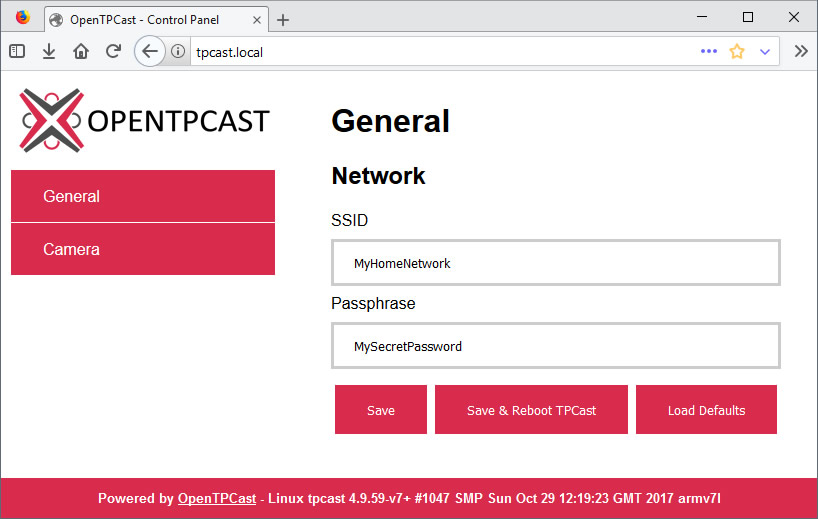

# Optimizing The TPCast Router

## Table Of Contents
* [Connecting To The TPCast Router](#connecting-to-the-tpcast-router)
* [Switching To Another Wi-Fi Channel](#switching-to-another-wi-fi-channel)
* [Switching To Another Wi-Fi Network Mode](#switching-to-another-wi-fi-network-mode)
* [Using A Different Router](#using-a-different-router)
* [Using Ad-Hoc Mode](#using-ad-hoc-mode)
* [Running The TPCast Router Independently From Your Home Router](#running-the-tpcast-router-independently-from-your-home-router)
* [Customizing Wi-Fi Credentials](#customizing-wi-fi-credentials)
  * [Updating The TPCast Router Credentials](#updating-the-tpcast-router-credentials)
  * [Updating The TPCast Power Box Credentials](#updating-the-tpcast-power-box-credentials)
* [Restoring The TPCast Router To Stock Settings](#restoring-the-tpcast-router-to-stock-settings)

## Connecting To The TPCast Router
The TPCast router control panel can be accessed from http://192.168.144.1 (CE) or http://192.168.1.1 (PRE) using a web browser and the following credentials:
- Username: tproot (if prompted)
- Password: 8427531 (CE) or 12345678 (PRE)

## Switching To Another Wi-Fi Channel
If you experience tracking issues, you may have to select a different channel.  The channel you select will vary based on region, outside interference and network configuration so try each channel until one works well for your setup.
1. In the router control panel, navigate to `WLAN Settings` > `Basic Settings` > `5G`, and change `Channel` from `AutoSelect` to a different option.  It is recommended to use channels in the lower end of the spectrum (36 ~ 48) as these have shown to be more reliable for most users.
1. Click `Save` to apply the changes.

## Switching To Another Wi-Fi Network Mode
If you continue to experience regular tracking issues, it may be nessecary to update the stock TPCast router to operate in "11a only" network mode.
1. In the router control panel, navigate to `WLAN Settings` > `Basic Settings` > `5G` and change `Network Mode` from `11vht AC/AN/A` to `11a only` (recommended for PRE/CE-CN users) or `11vht AC/AN` (recommended for CE-US/CE-EU users).
1. Click `Save` to apply the changes.

## Using A Different Router
Alternatively, using a more reliable router to overcome poor connection or bandwidth issues exhibited by the stock TPCast router may be an option.  The following routers have been tested by community members with the OpenTPCast upgrade and have shown to work as suitable replacements to the TPCast router:
- Ubiquiti UAP-AC-HD
- Asus RT-AC68U
- D-Link AC1750
- Linksys WRT1900ACS
- Netgear WNDR3700

## Using Ad-Hoc Mode
If you have a motherboard with built-in Wi-Fi or simply an extra Wi-Fi adapter available to you, it may be possible to avoid the need for any separate router by running in ad-hoc mode. This is a relatively untested approach and may not work for you. To avoid interference, it is best to use an adapter that supports 5 GHz.

1. Configure ad-hoc mode in Windows in `Settings` > `Network & Internet` > `Mobile hotspot`. Set a name and password, and set the band to 5 GHz. Click the slider to On.
1. Set the TPCast to use the new network with [Customizing Wi-Fi Credentials](#customizing-wi-fi-credentials).
1. If you encounter periodic dropped tracking and audio frames, it's possibly due to Windows scanning for networks in the background. You can fix this by running `netsh wlan set autoconfig enable=no interface=*` (or replace `*` with the adapter you're using if you have multiple). Switch `no` to `yes` to turn autoconfig back on.

## Running The TPCast Router Independently From Your Home Router
*Official configuration: Connect the TPCast Router between PC and Home Router.*
```
PC <---> TPCast Router <---> Home Router <---> Internet
             \
              -----> TPCast Power Box
```

*Recommended configuration: Connect the TPCast Router on secondary NIC on PC (either on-board or USB-to-Ethernet adapter).*
```
       ---> Home Router <---> Internet
      /
PC <--
      \
       ---> TPCast Router <---> TPCast Power Box
```
The official TPCast documentation instructs you to connect your TPCast router between your computer and home router, however this has shown to cause connectivity issues.  It is recommended to run the TPCast router independently of your home router by connecting the TPCast router to your computer using a secondary ethernet port on your motherboard, a secondary network card, or a USB-to-Ethernet adapter.

Note that when connecting the router in this configuration, it may be nessecary to assign a static IP for your computer on the second ethernet adapter.

1. Navigate to `Control Panel` > `Network and Sharing Center` > `Change adapter settings`.
1. Right click the network adapter that your TPCast Router is connected to, select `Rename` and rename it as `TPCast Router` for easier identification.
1. Double click the `TPCast Router` network adapter, double click on `Internet Protocol Version 4 (TCP/IPv4)` and enter the following settings:
  - Select `Use the following IP Address:`
    - IP address: `192.168.144.90` (It is recommended to use an address outside of the TPCast router's DHCP range to avoid conflicts.)
    - Subnet mask: `255.255.255.0`
    - Default gateway: `192.168.144.1`
  - Select `Use the following DNS server addresses:`
    - Preferred DNS server: `192.168.144.1`

## Customizing Wi-Fi Credentials
Devices upgraded to OpenTPCast can be configured to use custom Wi-Fi credentials for additional security, or to connect the TPCast to a different router.

### Updating The TPCast Router Credentials
1. In the router control panel, navigate to `WLAN Settings` > `Security Settings` > `5G` and change the `SSID` and `Password` fields to the desired credentials.
1. Click `Save` to apply the changes.

### Updating The TPCast Power Box Credentials

**Method 1: OpenTPCast Control Panel**

1. Navigate to http://tpcast.local (or `http://<tpcast-ip-address>` if not using Bonjour) in your web browser.
1. Navigate to `General` > `Network`, and amend `SSID` and `Passphrase` with the desired credentials.
1. Click `Save & Reboot TPCast` to apply the changes.

**Method 2: Configuration File**
1. [Remove the MicroSD card](https://github.com/OpenTPCast/Docs/blob/master/guides/SDCARD.md#accessing-the-microsd-card) from your TPCast power box, insert the MicroSD card into your computer and locate the boot partition in My Computer/This PC.
1. In the boot drive, edit the file `opentpcast.txt` in [Notepad++](https://notepad-plus-plus.org/) (or another text editor that handles Unix line endings), amend `ssid` and `passphrase` with the desired credentials, then save the file.
```
ssid=MyHomeNetwork
passphrase=MySecretPassword
```
1. Create an empty file in the boot partition called `initwlan` if the file does not exist, [ensuring that there is no file extension](https://support.microsoft.com/en-gb/help/865219/how-to-show-or-hide-file-name-extensions-in-windows-explorer).
1. Remove the MicroSD card from the computer and insert the MicroSD back into the TPCast power box.

## Restoring The TPCast Router To Stock Settings
1. Press the reset button on the back of the TPCast router to restore it to the default factory settings.
1. Navigate to the TPCast router control panel at http://192.168.144.1 (CE) or http://192.168.1.1 (PRE) using a web browser and the following credentials:
    - Username: tproot (if prompted)
    - Password: 8427531 (CE) or 12345678 (PRE)
1. Navigate to `Network Settings` > `LAN Settings` and set `IP address` to `192.168.144.1` (CE) or `192.168.1.1` (PRE).
1. Navigate to `WLAN Settings` > `Basic Settings` > `2.4G` and uncheck `Enable` for `Wireless`.
1. Navigate to `WLAN Settings` > `Basic Settings` > `5G`:
    1. Check `Enable` for `Wireless`.
    1. Set `Network Mode` to `11vht AC/AN/A`.
    1. Set `ssid` to the SSID specified on the TPCast power box label.
    1. Select `Enable` for `Broadcast(SSID)`.
    1. Select `AutoSelect` for `Channel`.
1. Navigate to `WLAN Settings` > `Security Settings` > `2.4G`:
    1. Set `SSID` to `TPCast_AP`.
    1. Select `Disable` for `Security Mode`.
1. Navigate to `WLAN Settings` > `Security Settings` > `5G`:
    1. Set `SSID` to the SSID specified on the TPCast power box label.
    1. Set `Password` to the passphrase specified on the TPCast power box label.
    1. Select `Mixed WPA/WPA2 - Personal(TKIP&AES)` for `Security Mode`.
1. Navigate to `DHCP Server` > `DHCP Server` > `Check Enable for DHCP Server`:
    1. Set `Start Address` to `100`.
    1. Set `End Address` to `200`.
1. If the router password differs from the stock configuration, navigate to `System Tools` > `Change Password` and set the router password to `8427531` (CE) or `12345678` (PRE).
