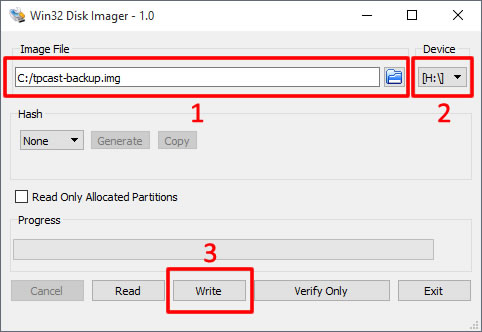

# Backing Up & Restoring A TPCast Power Box MicroSD Card
This section covers how to backup and restore an image for your TPCast Power Box MicroSD card using [Win32 Disk Imager](https://sourceforge.net/projects/win32diskimager/).  You will need at least 8GB of storage on your computer to store a backup image.

## Accessing The MicroSD Card

Video:

1. Remove the battery, power cable and USB cable from the power box.
1. Unscrew the 4 screws from the battery facing side of the power box using a Phillips-head/Crosshead screwdriver.
1. Remove the grated plastic side of the casing by applying pressure inward and upward on the notch at the bottom of the power box.
1. Locate the MicroSD card near the bottom of the device and slide the card out of its socket with your finger.
1. To reassemble, push the MicroSD card back into its socket, clip the two halves of the casing back together, screw the 4 screws back into the device, then reattach the cables and battery.

## Backing Up A MicroSD Card To An Image File

1. Connect the MicroSD card to your computer using a MicroSD card reader.
1. Launch Win32 Disk Imager.
1. In the "Image File" field, select a file path and enter a file name that will become your backup image. (e.g. C:/tpcast-backup.img).
1. Select the MicroSD drive from the Device drop down list.
1. Click "Read" to back up the image to your computer.

## Restoring An Image To A MicroSD Card

1. Connect the MicroSD card to your computer using a MicroSD card reader.
1. Launch Win32 Disk Imager.
1. In the "Image File" field, select the file that you orignally backed up that you will be restoring to the MicroSD. (e.g. C:/tpcast-backup.img).
1. Select the MicroSD drive from the Device drop down list.
1. Click "Write" to restore the image to your MicroSD card.
