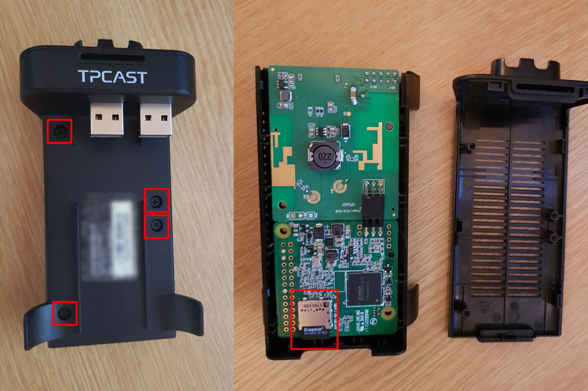
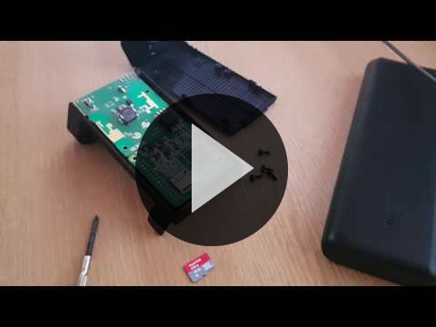
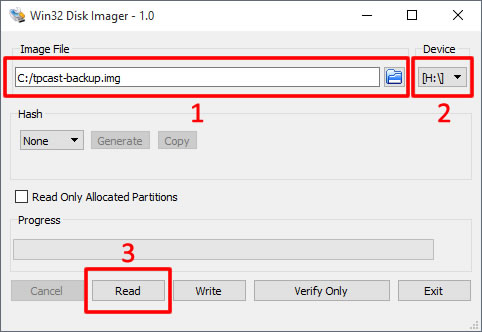
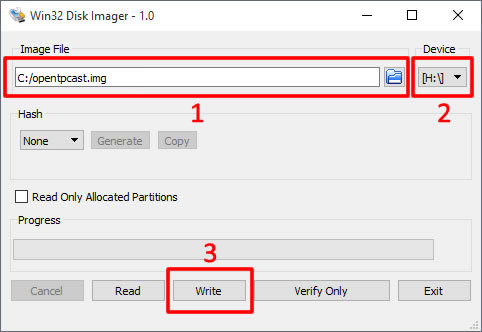
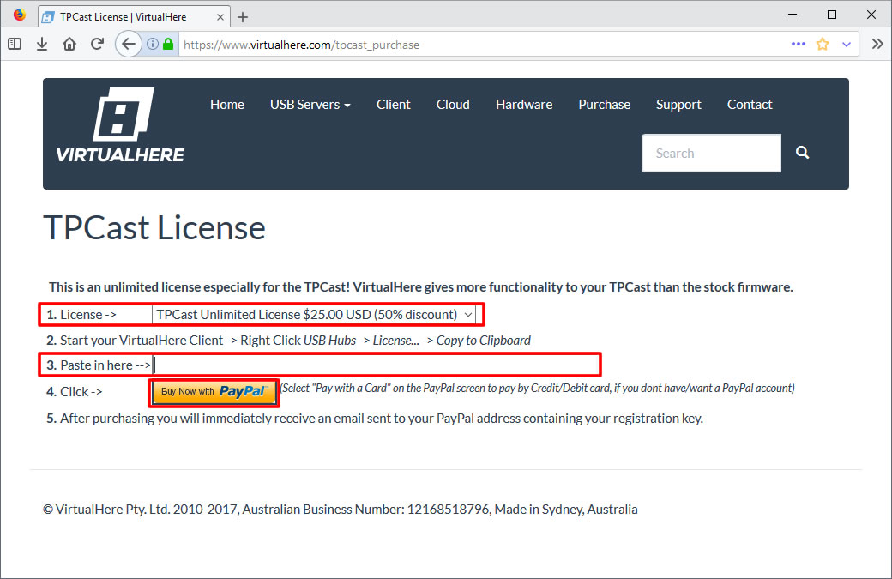
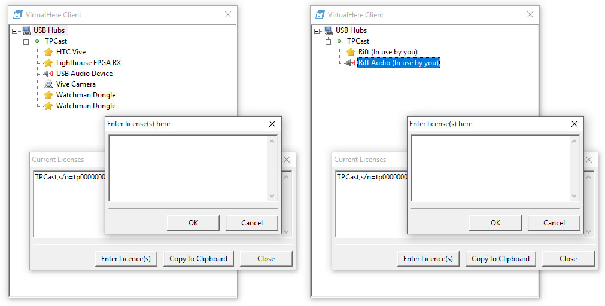

# Upgrading The TPCast To OpenTPCast

**This guide is currently untested with the TPCast for Oculus Rift.  There is no guarantee that the upgrade process will work with the TPCast for Oculus Rift until support has been confirmed by OpenTPCast developers.**

## Table Of Contents
* [Overview](#overview)
* [Known Issues](#known-issues)
* [Disclaimer](#disclaimer)
* [Preparation](#preparation)
  * [Hardware](#hardware)
  * [Software](#software)
  * [Miscellaneous](#miscellaneous)
* [Installation](#installation)
  * [Accessing The TPCast Power Box MicroSD Card](#accessing-the-tpcast-power-box-microsd-card)
  * [Backing Up The Stock TPCast MicroSD Card](#backing-up-the-stock-tpcast-microsd-card)
  * [Flashing The MicroSD Card With OpenTPCast](#flashing-the-microsd-card-with-opentpcast)
  * [Reassembling The TPCast Power Box](#reassembling-the-tpcast-power-box)
* [Configuring VirtualHere For TPCast](#configuring-virtualhere-for-tpcast)
  * [Purchasing A TPCast VirtualHere Licence](#purchasing-a-tpcast-virtualhere-licence)
  * [Applying The TPCast VirtualHere Licence](#applying-the-tpcast-virtualhere-licence)
  * [Connecting USB Devices](#connecting-usb-devices)
    * [HTC Vive](#connecting-htc-vive-usb-devices)
    * [Oculus Rift](#connecting-oculus-rift-usb-devices)
  * [Launching SteamVR Automatically](#launching-steamvr-automatically)
  * [Speeding Up TPCast Device Detection](#speeding-up-tpcast-device-detection)
* [Using Your TPCast After Upgrading](#using-your-tpcast-after-upgrading)
* [Connecting To The TPCast Over SSH](#connecting-to-the-tpcast-over-ssh)
* [Troubleshooting](#troubleshooting)
  * [VirtualHere Issues](#virtualhere-issues)
  * [Tracking Issues](#tracking-issues)
  * [SteamVR Issues](#steamvr-issues)

## Overview
This guide provides instructions on how to upgrade a stock TPCast device to OpenTPCast, which replaces the stock TPCast Connection Assistant software with a VirtualHere based solution running on Raspbian Stretch, and enables use of the on-board microphone and auxiliary USB port in the HTC Vive, and on-board microphone in the Oculus Rift.

## Known Issues
- The HTC Vive camera currently does not function correctly with VirtualHere.

## Disclaimer
**This upgrade is performed at your own risk! OpenTPCast and its contributers will not be held responsible for any physical damage, data loss or voided manufacturer warranties incurred due to modification or tampering of your TPCast hardware or software.**

This upgrade requires opening up your TPCast power box to remove and flash the internal MicroSD card with an OpenTPCast image.  We do not recommend performing this upgrade without [backing up the MicroSD card of your TPCast power box](SDCARD.md) to ensure that your TPCast device can be [restored](SDCARD.md#restoring-an-image-to-a-microsd-card) back to factory settings in the event of software compatibility issues during or after the upgrade.

To use VirtualHere USB Server, a TPCast-optimized licence key must be [purchased](https://www.virtualhere.com/tpcast_purchase) ($25 USD) after the upgrade.

## Preparation
### Hardware
- Ensure that your TPCast is functioning correctly with the stock router and software before attempting the upgrade.
- A MicroSD card reader is required to backup and flash images to your MicroSD card on your computer.
- A small phillips/crossheaded screwdriver is required to open the TPCast power box.
- Your device may come included with a Class 4 MicroSD card.  A Class 10 MicroSD card (4GB or higher in capacity) is recommended to speed up TPCast boot times.

### Software
- Ensure that any TPCast software is not running on your local machine during or after the upgrade.
- Ensure that you have at least 8GB of free space on your local machine during the upgrade to back up the TPCast MicroSD card.
- Download and extract (using [7-Zip](http://www.7-zip.org/)) the latest [OpenTPCast](https://github.com/OpenTPCast/Docs/releases) image.
- Download and install [Win32 Disk Imager](https://sourceforge.net/projects/win32diskimager/) on your local machine, which will be used to back up and restore images to and from a MicroSD card.
- Download & install [VirtualHere USB Client](https://virtualhere.com/usb_client_software) on your local machine, which will be used to forward USB devices associated with your VR device over your local network.  Note that a TPCast-optimized licence key must be [purchased](https://www.virtualhere.com/tpcast_purchase) to use with VirtualHere USB Server after the upgrade.
  - If you are prompted at any point to install Bonjour, you must install it to ensure that the TPCast can be discovered by VirtualHere USB Client correctly.

### Miscellaneous
- Follow the guide as it is laid out without skipping steps otherwise you may run into issues later.

## Installation
### Accessing The TPCast Power Box MicroSD Card


Video:

[](https://www.youtube.com/watch?v=rosli1DYzLc)

1. Remove the battery, power cable and USB cable from the power box.
1. Unscrew the 4 screws from the battery facing side of the power box using a Phillips-head/Crosshead screwdriver.
1. Remove the grated plastic side of the casing by applying pressure inward and upward on the notch at the bottom of the power box.
1. Locate the MicroSD card near the bottom of the device and slide the card out of its socket with your finger.

### Backing Up The Stock TPCast MicroSD Card

1. Connect the MicroSD card to your computer using a MicroSD card reader.
    - Ignore any warnings about the MicroSD card being corrupt, unreadable or reporting a small partition size - this is normal due to Windows being unable to read Linux partitions natively.
1. Launch Win32 Disk Imager.
1. In the `Image File` field, select a file path and enter a file name that will become your backup image. (e.g. C:/tpcast-backup.img).
1. Select the MicroSD drive from the `Device` drop down list.
1. Click `Read` to back up the image to your computer.  This will produce a file approximately 8GB in size.
1. Store the backed up file somewhere safe, as it will be required to [restore your TPCast](SDCARD.md#restoring-an-image-to-a-microsd-card) back to factory settings in the event of software compatibility issues during or after the upgrade.

### Flashing The MicroSD Card With OpenTPCast

1. Connect the MicroSD card to your computer using a MicroSD card reader.
    - Ignore any warnings about the MicroSD card being corrupt, unreadable or reporting a small partition size - this is normal due to Windows being unable to read Linux partitions natively.
1. Launch Win32 Disk Imager.
1. In the `Image File` field, select the OpenTPCast image that was downloaded and extracted (e.g. C:/opentpcast.img).
1. Select the MicroSD drive from the `Device` drop down list.
1. Click `Write` to flash the image to your MicroSD card.

### Reassembling The TPCast Power Box
1. Push the MicroSD card back into its socket.
1. Clip both sides of the plastic casing back together.
1. Screw the 4 screws back into the device.
1. Attach the USB cable, power cable and battery.

## Configuring VirtualHere For TPCast
Once the TPCast device is listed in VirtualHere USB Client, you can then [purchase](https://www.virtualhere.com/tpcast_purchase) and apply your VirtualHere USB Server unlimited licence key in VirtualHere USB Client.  Note That you cannot purchase a licence until you have a serial number which won't appear in Licences until TPCast shows up under USB Hubs.

### Purchasing A TPCast VirtualHere Licence

*Note: If you are reflashing a previously upgraded TPCast device and have already purchased a TPCast VirtualHere licence, you do not need to purchase a new licence and can skip this section.*

1. Launch VirtualHere USB Client and wait for the `TPCast` device to appear under `USB Hubs`.
1. Navigate to https://www.virtualhere.com/tpcast_purchase in a web browser.
1. Select `TPCast Unlimited Licence` from the `Licence` drop down menu.
1. In VirtualHere USB Client, right click `USB Hubs`, select `Licence...` and click `Copy to Clipboard`.
1. Switch back to the web browser, and paste the contents of your clipboard into the `Paste in here` field.
1. Click `Buy Now with PayPal` to complete the purchase, then check your inbox for a confirmation email containing the TPCast licence.

### Applying The TPCast VirtualHere Licence

1. Launch VirtualHere USB Client.
1. In VirtualHere USB Client, right click on `USB Hubs` and select `Licence...`.
1. Select `Enter Licence(s)` and copy your licence key from the email received following purchase.

### Connecting USB Devices
In VirtualHere USB Client, expand `USB Hubs`, expand `TPCast`, then right click and select `Auto-Use Device/Port` for each of the following devices:

#### [HTC Vive](#connecting-htc-vive-usb-devices)
  - Lighthouse FPGA RX
  - HTC Vive
  - Watchman Dongle
  - Watchman Dongle
  - USB Audio Device
      - This should be used if available to enable microphone support for older revisions of the HTC Vive.
  - Vive Camera
      - This should only be used when `USB Audio Device` is not available to enable microphone support for newer revisions of the HTC Vive, and the camera should be disabled in SteamVR settings to avoid stability issues.

#### [Oculus Rift](#connecting-oculus-rift-usb-devices)
  - Rift
  - Rift Audio

### Launching SteamVR Automatically
To launch SteamVR automatically when the TPCast power box is turned on:
1. In VirtualHere USB Client, expand `USB Hubs`, then expand `TPCast`.
1. Right click `Lighthouse FPGA RX`, select `Custom Event Handler...` and enter the following command:

```onClientAfterBind.$VENDOR_ID$.$PRODUCT_ID$=start steam://rungameid/250820```

To stop SteamVR from launching automatically when the TPCast power box is turned on:
1. In VirtualHere USB Client, expand `USB Hubs`, then expand `TPCast`.
1. Right click `Lighthouse FPGA RX`, select `Custom Event Handler...` and enter the following command:

```onClientAfterBind.$VENDOR_ID$.$PRODUCT_ID$=REMOVE```

### Speeding Up TPCast Device Detection

You can speed up the rate that VirtualHere USB Client scans for devices by editing the file `%appdata%\vhui.ini` in Notepad, and add or amend `AutoRefreshLookupPeriod=5` under the `[General]` section, then save the file.

## Using Your TPCast After Upgrading
Any installed TPCast software should be left disabled or uninstalled while using VirtualHere USB Client.

1. Launch VirtualHere USB Client.
1. Insert the battery into the TPCast power box and wait for it to boot up.
1. Once the TPCast device shows up in VirtualHere USB Client under USB Hubs, launch SteamVR if it is not already configured to run automatically.

## Connecting To The TPCast Over SSH
To connect to the TPCast power box to troubleshoot issues or perform further modifications, use the following details:
* Hostname: tpcast.local
* Port: 22
* Username: pi
* Password: 1qaz2wsx3edc4rfv

## Troubleshooting
### VirtualHere Issues
If VirtualHere USB Client is not detecting the TPCast power box:
* Check the TPCast router's DHCP list while the TPCast power box is turned on to make sure that it is connected to the network, and ping the TPCast power box from your computer to make sure it can be reached.
* Ensure that you have Bonjour installed and your firewall is not blocking Bonjour or VirtualHere USB Client so that VirtualHere can detect the TPCast power box, otherwise you will have to manually specify the IP address of the TPCast power box in VirtualHere USB Client by right clicking `USB Hubs` > `Specify Hubs...` > `Add` > `192.168.XXX.XXX:7575` > `OK`.

### Tracking Issues
If you experience tracking issues or devices are being dropped in SteamVR after upgrading, try [switching Wi-Fi channels](ROUTER.md#switching-to-another-wi-fi-channel) or [switching Wi-Fi network mode](ROUTER.md#switching-to-another-wi-fi-network-mode) in your TPCast router.

### SteamVR Issues
Reboot your computer and power cycle all devices including the TPCast power box, HDMI transmitter, router and HTC Vive break-out box (if applicable) if you experience issues with the following:
* SteamVR does not detect devices.
* SteamVR displays errors.
* HMD screen appears black.
